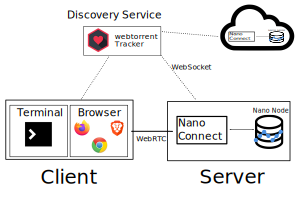

# Nano Connect

## What is it

Nano Connect is a relay server that allows you to use the RPC server from a browser or from a terminal without any costs.  


## How it works
It works by people running a Nano Node and a Nano Connect server.  The Nano Connect server is listening on many WebRTC ports and is discovered by seeding itself on the Bittorrent network.  People find your Nano Server by connecting to the Bittorent tracker and asking for a peer.  Once you've connected to a peer(A Nano Connect Server) you disconnect from the bittorent tracker and you then send your RPC commands to the Nano Connect Server and it will relay them to the Nano Node. 




## Goal 

To make accessing a Nano Node completely free by allowing people to run a Nano client that can have a intermediate connection. Think folding@home but for Nano.

## Getting started
### 1. Getting a node started
```bash
# main totorial
# https://docs.nano.org/running-a-node/node-setup/

# First you have to get nano docker container
docker pull nanocurrency/nano

# Then run the network
docker run --restart=unless-stopped -d \
  -p 7075:7075/udp \
  -p 7075:7075 \
  -p [::1]:7076:7076 \
  -p [::1]:7078:7078 \
  -v ${NANO_HOST_FOLDER}:/root \ #This folder will hold a VM's data
  --name nano_server \
  nanocurrency/nano:latest 

# Then your going to have to wait for the server to fully bootstrap itself.
```

### 2. Running 

```bash
# install dependencies
npm install

# start the server
node ./examples/serverExample.js

```


## Debug

### Logs
Turn on with node logging with DEBUG=NSindexInfo,NSindexError node ./examples/serverExample.js
* NSIndexInfo #stands for NanoClientIndexInfo
* NSIndexError
* NSindexInfo  
* NSindexError

### start own bittorent-tracker 
~~~bash
bittorrent-tracker
# ws://localhost:8000
~~~

### Librarys Fundimental to make this work.
* [nano-node-rpc](https://github.com/BitDesert/nano-node-rpc)
* [bittorrent-tracker](https://github.com/webtorrent/bittorrent-tracker)
* [yargs](https://github.com/yargs/yargs)